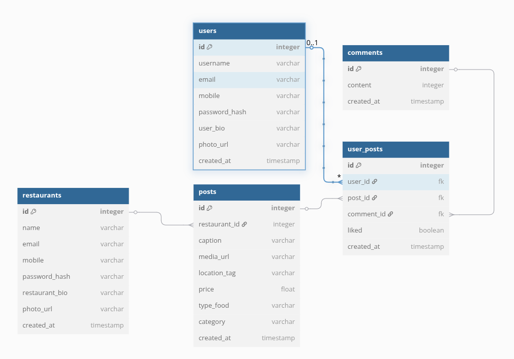

# 🍽️ SavorySafari

**SavorySafari** is a Kenyan culinary social media platform that allows food lovers and restaurants to share, discover, and celebrate authentic dishes from across the country. Built with a modern stack (React + Flask), the app bridges cultural cuisine and digital community through beautiful food posts, comments, and likes.

## Live Demo

[Visit the live site](https://savorysafari.vercel.app)

Backend API (Render)

## ERD



## Key Features (MVPs)

✅ Role-based registration: "Restaurant" or "User"  
✅ Restaurants can create food posts (with captions & images)  
✅ Users can like and comment on posts  
✅ Clean sidebar layout with scrollable feed  
✅ Profile editing via settings page  
✅ Social media footer modal  
✅ Protected routes and form validation
✅ Has login,register and logout

## Tech Stack

**Frontend** React, Tailwind CSS
**Routing** ReactRouter
**Forms** Formik +Yup
**Icons** Lucide-React
**Alerts** Notistack
**Backend** Flas(Python)
**Database** Flask SQLAlchemy
**API** Flask RESTful
**Deployment** Vercel (Frontend), Render(Backend)

## How to Run It Locally

**Clone the Repository**

git clone https://github.com/phil-ogutu/savory-safari.git
cd savorysafari

**Set up Backend**
cd backend
python3 -m venv venv
source venv/bin/activate
pip install -r requirements.txt
flask run

**Set up Frontend**
cd frontend
npm install
npm run dev

**Future Plans**
✅ Advanced search with filters (e.g. region, ingredients)
✅ AI-based food recommendations
✅ Messaging and review system
✅ Restaurant verification and analytics
✅ Food delivery integration

**Challenges Faced**
Managing role-based access on both frontend and backend
Designing responsive and consistent UI for both types of users
Integrating Flask APIs with React securely
State management for authenticated sessions

```

```
